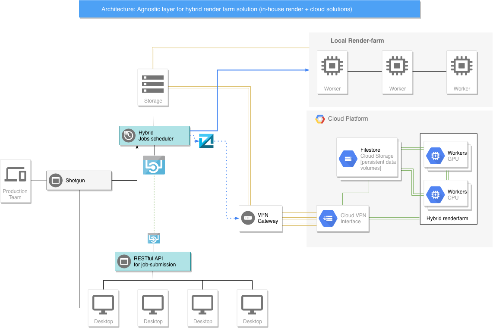

= An Hybrid Render-farm 
:toc:

== Motivation
The motivation behind this project is to provide a prototype solution for one of the most common pain-point of any animation or visual-effects studio: the _render-farm_. Almost every facility needs additional computational-power when a show approaches the deadline. With almost 20 years of field-experience I can list numerous occasions during which the local render-farm, no matter how big, reached full capacity. These are the main reasons why this happens: 

* The client asked for substantial changes near the end of a production, requiring several department to update all the renders.

* New turnarounds: at some point during production, additional shots are added to the project. These shots weren't part of the original planning, but the studio might have 'space' and economic reason to bid on these additional bulk of work. It seems reasonable to bid on additional shots if you already have rigs, setups and Artists ready, but, what production often ignores is the additional overhead of rendering power which is needed. This is when the farm becomes a bottleneck and is too late to buy new machines to add to the farm. 

* Another situation occurs when a studio has multiple concurrent shows. Production 'naively' prioritizes resources according to the earliest deadline in shotgun, but these priorities often clash when more than one show deliver around the same dates. This inevitably reduces the amount of resources available for any remaining show scheduled for a later delivery, creating a cascade effect of delays in every department.

*Because of these reasons, a solution which allows a render-farm to grow during critical moments could be a life saver for any VFX house.*

== Abstract solution
[#test]
.Hybrid renderfarm structure


There are several solution for rendering on the cloud, moreover, almost every single facility has a local render-farm with a set of pipeline tools to dispatch jobs. My approach is based on two fundamental beliefs: job prioritization should be handled by production and Artists which should focus on the 'artistic' aspect of creating beautiful pixels, not to deal with esoteric aspects of managing job scheduling on a render-farm. +
Therefore, I think that the Artist's interface used to dispatch a render should be 'one' and 'agnostic' in regard to where and on what machines the render is processed. In other words, it would be of help for an Artist if the render UI inside the DCC packages used should be the same UI to either render on a local farm, or on a cloud-farm. After all, if the system is well integrated, no one would care if the renders are processed in house or on a cloud-system. +
This is the main reason why this project proposes an agnostic abstraction layer to dispatch jobs form a local machines. Each job request is generic and is sent to a scheduling host, which determines where to process the job (local farm or cloud) and assigns priorities based on 'shotgun', which are handled by production. 

<<<

== Implementation
The way I decided to implement this architecture is by creating an API layer between the DCC software [Maya, Houdini, Nuke, etc.] and a localhost which runs a scheduler and dispatches jobs to either a local render-farm or a remote location (could be a Google, Amazon cloud provider, or even another branch of the same studio which has idle machines).
The graph above illustrate the proposed model: in blue the portion that implements the REST API to create generic job submissions. +

NOTE: Using a micro-system approach not can free up the artist from responsibility of managing on which machine to submit a job, but also allows the artist workstation to stay *disconnected from the internet*, as most of the studio have to comply to MPAA requirements.

<<<

== RESTful API
REpresentational State Transfer (REST) json format:

=== Usage
All responses will have the form:
```json
{
    "data" : "mixed type holding content of response"
    "message" : "description of what happened"
}
```

.Usage Example (Work in progress)
image::data/render-scheduler-wip.gif[Usage example WIP]

==== Definitions (WIP)

.Table Title
|===
|API Endpoint |Arguments |Description |Result 

|`GET /jobs`
| None
| Returns a list of jobs
| ```[
    {
    "jobID" = "00001",
    "name" = "some-render-job-name"
    "jobs-status" = "RUNNING"
    },
    {
        ...
    }
]

| `DELETE /jobs`
| Job ID
| Deletes a job from the current queue
| Returns the JOB_ID if successful 

|`POST /new_job` 
|`"name":string` job name
|Send a new job on the farm
|Return the JOB_ID, if successful
|===

=== Tools and libraries
Options for a web-server API are to implement through django, flask, bottle, or manually. My choice is to try django as seems the most solid and most used framework available. As second step will be interesting to implement this from scratch (no external libraries).

* link:https://swagger.io/tools/swagger-ui/[Swagger.io] seems to be the nicest option for documenting a RESTful api 
* link:https://github.com/django-tastypie/django-tastypie[Tastypie] 

